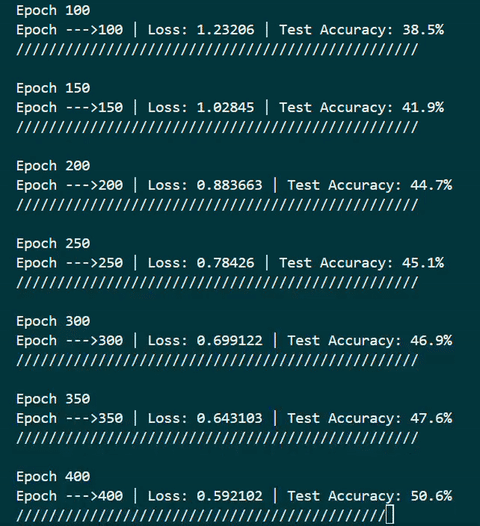

# Autograd-Based Neural Network Library in C++

A lightweight C++ neural network built from scratch, featuring an autograd engine and matrix-based layers. This project focuses on neural network training and how models learn internally rather than relying on external machine learning libraries. Autograd functionality inspired by Andrej Karpathy's micrograd.



**Note:** 
To run the MNIST model, you'll have to obtain the csv files from https://github.com/cvdfoundation/mnist/tree/master, and place them in the same directory as the project

---

## Overview

This project implements a **Multi-Layer Perceptron (MLP)** as a sequence of dense layers. Each layer performs a linear transformation followed by a non-linear activation:

```
x → (W₁x + b₁) → σ → (W₂x + b₂) → σ → ... → output
```

Instead of thinking in terms of individual neurons, the network is built as a **chain of matrix operations**, which is how modern ML frameworks operate internally.

---

## Core Design

### MLP Class

```cpp
std::vector<size_t> sizes;
std::vector<Layer> layers;
double learningRate;
```

* **sizes**
  Defines the architecture of the network.
  Example:

  ```cpp
  {784, 64, 10}
  ```

  * 784 input features
  * 64 hidden neurons
  * 10 output neurons

* **layers**
  Stores the actual computational layers. Each layer is derived from consecutive pairs in `sizes`.

* **learningRate**
  Controls how much weights are updated during training.

---

### Layer Class

Each layer represents a fully connected transformation:

```cpp
Layer(size_t numNeurons, size_t inputFeatures, ActivationType& act_t);
```

Internally, a layer contains:

* **Weight matrix (W)** of shape:

  ```
  inputFeatures × numNeurons
  ```
* **Bias vector (b)** of shape:

  ```
  1 × numNeurons
  ```
* **Activation function** (e.g., Sigmoid)

---

## How the Network is Built

Constructor:

```cpp
MLP(size_t inputSize, std::vector<size_t> outputSizes, double learningRate);
```

Example:

```cpp
MLP model(784, {64, 10}, 0.0025);
```

This produces:

| Layer | Input Features | Neurons | Weight Shape |
| ----- | -------------- | ------- | ------------ |
| 1     | 784            | 64      | 784 × 64     |
| 2     | 64             | 10      | 64 × 10      |

Construction logic:

```cpp
sizes = {inputSize, ...outputSizes};

for (i = 0; i < sizes.size() - 1; i++) {
    layers.emplace_back(sizes[i+1], sizes[i]);
}
```

---

## Data Flow

```
X: (batch_size × inputFeatures)
```

*Forward pass:*

```
Layer 1: (batch × 784) → (batch × 64)
Layer 2: (batch × 64)  → (batch × 10)
```

Each layer computes:

```
output = activation(X * W + b)
```

*Backpropagation:*

After the forward pass produces a prediction, the network computes an error using a loss function. Backpropagation then propagates this error backward through each layer, applying the chain rule to determine how much each parameter contributed to the final loss.

```
Forward pass:   input → layers → prediction
Backward pass:  loss → gradients → parameter updates
```

To support backpropagation, the network is treated as a directed acyclic graph (DAG) of computation nodes (layers).

A topological sort is performed to determine a valid forward execution order.  
Backpropagation then follows the reverse of this ordering to correctly compute gradients.


# Loss Function

For simple regression-style training (used in XOR and similar tests), the loss is typically Mean Squared Error:

Loss = (1 / N) * Σ (y_pred - y_true)

Softmax binary cross entropy loss is also implemented

*Key Idea (Chain Rule)*

Each layer computes how the loss changes with respect to its parameters:

**Backpropagation Through a Layer**

Each layer performs the following steps during backpropagation:

1. Compute error signal
```
δ = (dL/dOutput) ⊙ σ'(Z)
σ'(Z) is the derivative of the activation function
⊙ represents element-wise multiplication
Z is the pre-activation value (XW + b)
```
2. Compute gradients
```
dW = Xᵀ · δ (gradient of weights)
db = sum(δ over batch) (gradient of biases)
```
3. Propagate error backward
```
dX = δ · Wᵀ
```

This value (dX) is passed to the previous layer.

Parameter Update

Once gradients are computed, weights and biases are updated using gradient descent:

W = W - learningRate * dW
b = B - learningRate * db

### Shape Consistency

Each layer must satisfy:

```
(previous output size) == (current inputFeatures)
```

---

## Training Examples

### XOR Problem 

The XOR problem is a classic test to verify that your MLP can learn **non-linear decision boundaries**.

Dataset:

```
Input    Output
0 0  →   0
0 1  →   1
1 0  →   1
1 1  →   0
```

Why it matters:

* A single linear layer cannot solve XOR
* Your MLP must have **at least one hidden layer**
* Confirms your forward + backward propagation works

Typical architecture:

```cpp
MLP model(2, {2, 1}, 0.1);
```
**Found in TestFile.cpp for quick testing**

IMPORTANT: For XOR training, set SIGMOID activation in MLP::forward.
           Loss uses binary cross entropy loss
```
if (i == layers.size() - 1) // last layer activation
{
  input = Activation::nActivationFnc[ActivationType::SIGMOID](input);
}
else
{
  input = Activation::nActivationFnc[ActivationType::SIGMOID](input);
}
```

---

### MNIST Dataset (Real Use Case)

MNIST is a dataset of handwritten digits:

* Input: 28 × 28 grayscale image → flattened to **784 features**
* Output: 10 classes (digits 0–9)

Typical setup:

```cpp
MLP model(784, {128, 64, 10}, 0.001);
```

* Input layer: 784 features
* Hidden layers: 128 → 64 neurons
* Output layer: 10 neurons (one per digit)

Training goal:

* Learn to map pixel data → correct digit classification

**Found in TestFile.cpp for quick testing**

IMPORTANT: For MNIST training, set RELU activation in MLP::forward and last layer to empty. Loss uses softmax cross entropy loss
```
if (i == layers.size() - 1) // last layer activation
{
}
else
{
  input = Activation::nActivationFnc[ActivationType::RELU](input);
}
```
---

## Implementation Notes

* `sizes.reserve(...)` is used to reduce memory reallocations
* Layers are built using adjacent values in `sizes`
* Input is passed as a matrix, not as a layer

---

## Future Improvements

* Batch training
* Optimizers (SGD, Adam)
* Weight initialization (Xavier / He)

---

## Summary

This project builds an MLP from first principles using:

* Matrices for computation
* Layers as modular transformation units

The central idea:

> Each layer transforms data from one representation into another using learned weights and nonlinear activation.

---

## Build Instructions

```bash
make        # Build the project
./app       # Run the program
make clean  # Remove compiled object files
```